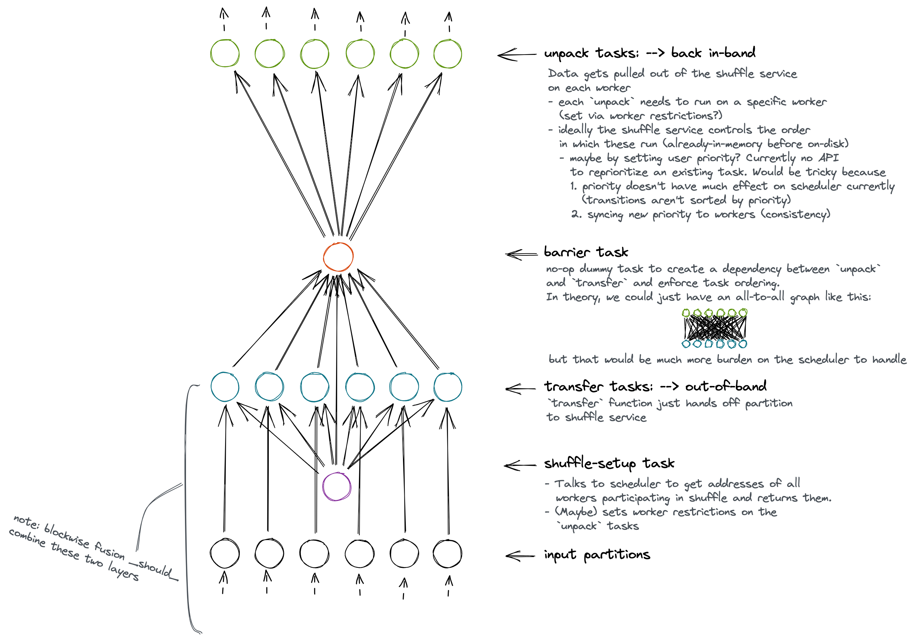
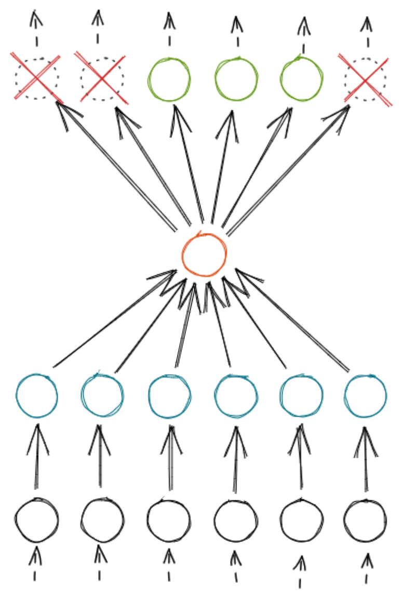

# Peer-to-peer DataFrame shuffling

This is a proposal for the high-level design of an extension built into distributed for shuffling very large DataFrames reliably and performantly. It does so by transferring data between workers out-of-band (not managed by the scheduler) using stateful worker extensions. This significantly reduces the size of the graph and eliminates the scheduler as a bottleneck, compared to the current task-based shuffle.

This work builds off the proof-of-concept in https://github.com/dask/dask/pull/8223.

## Motivation

Shuffles are an integral part of most DataFrame workloads, as part of a `merge`, `set_index`, or `groupby().apply()`. Shuffling is a poor fit for centralized graph-based scheduling, since the graph is all-to-all (O(N²) in size), yet the logic is so simple, it gets little benefit from centralized coordination, while suffering significant overhead from it. With task-based shuffles, the amount of data we can shuffle effectively (before workers run out of memory, or the scheduler crashes, or both) is severely limited. By allowing workers to autonomously exchange data with their peers, and manage disk and memory usage in a more fine-grained way, that limit becomes significantly higher.

See https://coiled.io/blog/better-shuffling-in-dask-a-proof-of-concept/ for more background.

## Goals and non-goals

End goals:
* Can reliably shuffle orders-of-magnitude larger datasets (in total size and number of partitions) than the current task-based shuffle
* Maintainable, thoroughly tested code using (or adding) public APIs
* Can shuffle larger-than-memory datasets by spilling to disk
* Constant, predictable memory footprint per worker, which scales linearly with partition size, not total number of partitions
* Just works, without users needing to tune parameters (buffer sizes, etc.)
* Graceful restarting when possible, and quick failure when not
* All state is cleaned up on success, failure, or cancellation
* Shuffle performance is IO-bound (network, disk)

Non-goals:
* Utilize new workers that enter the cluster midway though a shuffle
* Resilience via data duplication (a shuffle can continue through losing some number of workers)
* Worker loss only requires partial re-transfer of data

## Plan

The implementation will be completed in multiple stages (order TBD after #1):
1. Establish the patterns for how this out-of-band system will interact with distributed, in the simplest possible implementation with no optimizations.
1. Retries (shuffle restarts automatically if a worker leaves)
1. Serialization
1. Graph-culling optimization
1. Improve performance with concurrency and buffering if possible
1. Spill-to-disk
1. Backpressure
1. Performance

## Design

Here we'll discuss the highest-level architectural components of the shuffling system.

_Note: unlike the POC PR, we propose keeping this code in `dask/distributed`, not `dask/dask`. The implementation will be somewhat dependent on worker internals, so internal changes in `distributed` are far more likely to break things than changes in `dask`. We'd like tests to fail (and fixes to happen) in the same repo as the changes that break things. Plus, the code is very `distributed`-specific anyway._

### Task graph

The whole point of a peer-to-peer shuffle using a separate worker extension is to not have to capture the full operation in a dask graph.
Therefore, the primary purpose of the graph is to mediate between dask-managed data and out-of-band processing:
- Hand off dask-managed data to be processed by the extension
- Bring data produced out-of-band back into dask
- Clean up when keys depending on the shuffle are cancelled

<!-- The graph also has a secondary synchronization benefit, letting us bypass some difficult distributed problems (exactly-once initialization and cleanup tasks, determining when all peer-to-peer transfers are complete) by leaning on the scheduler. -->



### `ShuffleExtension`

Problems this solves:
* Holding per-worker out-of-band state for an in-progress shuffle
* Adding new handlers in an organized way for workers to transfer shuffle data
* Doing the above cleanly with multiple concurrent shuffles (`merge`)
* Coordinating multiple concurrent shuffles which may need to share limited resources (memory, threads, etc.)
* Getting metrics back to the scheduler/dashboard, like managed memory & bytes spilled to disk (eventually)

The `ShuffleExtension` will be built into distributed and added to workers automatically (like the `PubSubWorkerExtension`). It'll add some routes to the worker; something like:

```python
def shuffle_receive(comm, shuffle_id: ShuffleId, data: DataFrame) -> None:
    """
    Handler: Receive an incoming shard of data from a peer worker.
    Using an unknown ``shuffle_id`` will first initialize any state needed for that new shuffle.
    """
    ...
```

It'll also expose functions to be called from tasks in the graph:
```python
async def add_partition(self, data: pd.DataFrame, shuffle_id: ShuffleId) -> None:
    """
    Task: Hand off an input partition to the ShuffleExtension.

    This will block until the extension is ready to receive another input partition.
    Using an unknown ``shuffle_id`` is an error.
    """
    ...

async def get_output_partition(self, shuffle_id: ShuffleId, output_partition: int) -> pd.DataFrame:
    """
    Task: Retrieve a shuffled output partition from the ShuffleExtension.

    Calling this for a ``shuffle_id`` which is unknown or incomplete is an error.
    """
    ...
```

The `ShuffleExtension` will hold all per-shuffle state and buffers specific to that worker. For example, things like (will vary depending on the stage of the implementation):
- a buffer of received shards
- a buffer of outgoing shards (waiting to accumulate enough to be worth sending to a worker)
- a datastore that transparently spills received shards to disk
- locks or synchronization mechanisms

The `ShuffleExtension` will also hold any global state shared by all shuffles, such as worker threads or coroutines.

Most of the implementation-specific logic will happen in the `ShuffleExtension`. As we improve performance, add concurrency, etc., this code will change the most (though the interface will likely not).

The `transfer` tasks will pass their input partitions into the `ShuffleExtension`, blocking the task until the extension is ready to receive another input. Internally, the extension will do whatever it needs to do to transfer the data, using worker comms to call the `shuffle_receive` RPC on peer workers. Simultaneously, it'll handle any incoming data from other workers.

### Scheduler Shuffle Extension

Problems this solves:
* Workers need to all have the same list of peers participating in the shuffle (otherwise data could end up in two different places!)
* Scheduler needs to know where to run the `unpack` tasks which bring data back in-band

A `ShuffleSchedulerPlugin` will also be built into distributed and added to the scheduler automatically. It'll add a handler to the scheduler, like:

```python
def get_workers_for_shuffle(self, com, id: ShuffleId) -> list[str]:
    """
    Get the list of worker addresses participating in a shuffle.
    Using an unknown ``id`` registers the shuffle and initializes the list of workers.
    All subsequent requests for the same ``id`` will return the same list.
    """
    ...
```

In the initial `transfer` tasks, each worker will call the `get_workers_for_shuffle` RPC on the scheduler. By centralizing this state on the scheduler, we can ensure each worker gets a consistent list of peers. Then the scheduler will watch transitions to determine when the shuffle is over and it can release this stored state.

*Rejected alternative: a single `shuffle_setup` task.*
Originally, we considered using a singular setup task in each shuffle's graph, which all the `transfer` tasks depended on. This task used `Client.scheduler_info()` to get the list of peers, with no scheduler plugin. This worked, with the problem that in a graph with multiple shuffles, all the setup tasks would run at the same time at the very beginning of the computation (since they had no dependencies, the scheduler would schedule them immediately). This was not ideal, since the list of workers could be quite outdated by the time the shuffle actually ran.

The scheduler extension will probably take on more responsibilities in later stages of this shuffle implementation. For example, it might:
* Set worker restrictions for output tasks (instead of doing this from workers via RPC in the barrier task)
* Call an RPC on all workers that a shuffle is starting, so they can set up any necessary state (threads, etc.)
* Skip the `RerunGroup` idea (described below) entirely; do it all in the plugin with a callback for remove_worker
* Tell workers how many output tasks are actually in the graph, resolving the graph-culling issue (mentioned later)

### Retries and cancellation

Problems this solves:
* Causing all tasks in the shuffle to rerun when a worker leaves
* Cleaning up out-of-band state when a user cancels a shuffle, or it errors

*Note: this proposed system may not actually be sufficient, or may be so tuned to shuffling that it doesn't make sense as a public API. We may instead implement something like this just within the scheduler shuffle plugin.*

Because most the tasks in the shuffle graph are impure and run for their side effects, restarting an in-progress shuffle requires rerunning _every_ task involved, even ones that appear to have successfully transitioned to `memory` and whose "results" are stored on non-yet-dead workers.

Additionally, cleanly stopping a running shuffle takes more than just releasing the shuffle tasks from memory: since there's out-of-band processing going on, the `ShuffleExtension` has to be informed in some way that it needs to stop doing whatever it's doing in the background, and clear out its buffers. Also, executing tasks may be blocking on the `ShuffleExtension` doing something; without a way to tell the extension to shut down, those tasks might block forever, deadlocking the cluster.

Therefore, we propose adding a `RerunGroup` (`ImpureGroup`? `CoExecutionGroup`? `RestartGroup`? `OutOfBandGroup`? name TBD) structure to the scheduler which intertwines the fates of all tasks within it: if any one task is to be rescheduled (due to its worker leaving), all tasks are restarted; if any one is to be prematurely released (due to cancellation), all are released. (xref [dask/distributed#5403](https://github.com/dask/distributed/issues/5403))

Membership in a `RerunGroup` is implemented via task annotations, where each task gives the name of the `RerunGroup` it belongs to. A task can belong to at most one `RerunGroup`. TBD if we will enforce any structural restrictions on `RerunGroup`s to prevent odd/invalid states from emerging—we probably should, such as not allowing disjoint parts of the graph to be in the same `RerunGroup`, etc. (Note that fixes to annotations will be required for this to work, particularly clear rules for when and how annotated layers can be fused xref [dask/dask#7036](https://github.com/dask/dask/issues/7036).)

Additionally, the scheduler informs workers whenever a `RerunGroup` is restarted or cancelled. Workers will have a way to pass this information on to any interested out-of-band operations. This could be something like:
- Workers have a named `threading.Event` for each `RerunGroup` that any of their current tasks belong to. When the scheduler tells workers about a restart/cancellation, they `set()` the corresponding event so that some background thread can respond accordingly.
- A `register_cancellation_handler(rerun_group: str, async_callback: Callable)` method on workers that registers an async function to be run when that group is cancelled/restarted. A potential upside (and potential deadlock) is that the scheduler's `cancel_rerun_group` RPC to workers could block on this callback completing, meaning the scheduler wouldn't treat the `RerunGroup` as successfully cancelled until every callback on every worker succeeded. That could give us some nice synchronization guarantees (which we may or many not actually need) ensuring a shuffle doesn't try to restart while it's also trying to shut down.

### Graph-rewrite on cull

Problems this solves:
* When only some output partitions of a shuffle are needed in downstream tasks, the shuffle still needs to behave correctly
* In this case, the shuffle can also transfer less data as an optimization
* Two shuffles of the same input—just with different output partitions culled—must produce correct data and not collide in key names

With code like `df2 = df.set_index("name").loc["Alice":"Bob"]`, graph culling removes the `shuffle_unpack` tasks for unused output partitions:



In order to determine when the shuffle is over, each worker will depend on comparing how many times `get_output_partition` was called to how many output partitions belong on that worker. Because output partitions could be empty, it's not enough to just count how many partitions data was received for—the shuffle has to know this count ahead of time.

If not all of the output partitions are actually retrieved (because the tasks to retrieve them were culled), the extension will never clean up, and all that extra data will just sit on the worker forever.

Additionally, we have an optimization opportunity: if we only need output partitions 1-3, then the extension can drop all input rows that don't match, vastly reducing the amount of data transferred.

Therefore, we propose adding another graph optimization step: after culling, we'll also inject the list of post-culling output partitions into the initial `transfer` tasks. Additionally, we'll need to change the keys of these `transfer` and `barrier` tasks, because they now produce different data.

It's critical to change the keys, so that workloads like this behave correctly:
```python
shuffled = df.set_index("name")
s1 = shuffled.loc["Alice":"Bob"].persist()
sleep(10)
s2 = shuffled.persist()
```
If there are some `transfer` tasks for `s1` running when `s2` gets submitted, the scheduler wouldn't run `s2`'s `transfer`s if they had the same keys as `s1`'s—it would just reuse `s1`s. However, those transfers would be doing something different (sending only some data vs all data).

*Note: it's possible to make this situation behave correctly without a new graph optimization, by sending all data (even for unneeded partitions) and having the scheduler plugin tell workers at runtime via RPC when the shuffle is over. We'll do this in the initial implementation for simplicity, but expect the optimization to be quite valuable to users.*

### Spilling to disk

Problems this solves:
* Shuffling larger-than-memory datasets requires writing some of the data to disk
* Makes the worker memory requirement depend only on the size of each partition of the dataset, not the total size of the dataset
* Applies backpressure to senders when spill-to-disk can't keep up with incoming data (see backpressure section)
* Does all the above without blocking the event loop

After the initial shuffling framework is built, we'll want to support larger-than-memory datasets. To do so, workers will spill some of the data they receive from peers to disk.

For testability, we'll implement a standalone mechanism for this. Most likely, it'll be a key-value buffer that supports appends to keys, like:

```python
async? def append(**values: pd.DataFrame) -> None:
    "Append key-value pairs to the dataset"
    ...

async? def get(key: str) -> pd.DataFrame:
    "Get all data written to a key, concatenated"
    ...

async? def remove(key: str) -> None:
    "Remove all data for a key"
    ...

async? def clear() -> None:
    "Remove all data"
    ...

async? def set_available_memory(bytes: int) -> None:
    """
    Change the memory threshold for spilling to disk.

    If current memory use is greater than the new threshold, this blocks until excess memory is spilled to disk.
    """
    # NOTE: necessary for concurrent shuffles: if a shuffle is already running and another wants to start,
    # the first shuffle needs to spill excess data to disk so the two can share memory evenly.
    ...
```

Note that the interface, purpose, and functionality are essentially the same as [partd](https://github.com/dask/partd). We may just use partd here, or modify partd such that it fits our needs, rather than implementing something new.

Most likely, the writes to this buffer will be very small. If so, the system must handle small writes performantly.

If a shuffle is aborted (error, cancellation, or retry), the buffer will be told to clean up all its data (both on disk and in memory).

The buffer will have some way of applying backpressure on `append`s, so if it can't keep up with all the data it's being asked to write to disk, it can inform callers. This will be bubbled up to tell peer workers to slow down data sending (and possibly production) so this worker doesn't run out of memory.

The buffer will handle serialization, transformation, and compression of the input data. Therefore, if it ends up being an async interface and this is event-loop-blocking work, it'll have a way to offload this work to threads.

The implementation will depend a lot on our network serialization format, and our concurrency model. For example, if we were sending Arrow [`RecordBatches`](https://arrow.apache.org/docs/python/data.html#record-batches) over the network, already grouped by output partition, we could just write those serialized bytes straight to disk from an async comm handler (using [aiofiles](https://github.com/Tinche/aiofiles) or the like). On the other hand, if we're sending DataFrames over comms and deserializing them immediately on the receiving side (as in the proof-of-concept PR), then a lot more work will be involved: re-serializing them, potentially even accumulating an in-memory buffer of DataFrame shards to be re-concatenated, serialized, and compressed if the serialization scheme is inefficient for lots of small DataFrames.

For this reason, we won't make any more guesses about how this is actually going to work.

Additionally, it would be nice if the buffer could integrate with the worker's reporting of managed memory and data spilled to disk. Obviously, we'd have to create the worker and scheduler interfaces for this first, but the buffer should at least track these numbers so we can eventually report them.

### Serialization

Problems this solves:
* Workers need to transfer data to each other
* Buffer needs to write data to disk
* Serialization performance determines where—and how much—we need to copy and reshape data
* Ideally, serialization-deserialization roundtrips are minimized

The performance characteristics of serialization (and networking) have a huge impact on how the `ShuffleExtension` is actually implemented to be performant.

In the proof-of-concept PR, we used distributed's built-in serialization, which basically just pickles DataFrames. We assume this to be inefficient for lots of small DataFrames, so we regroup, buffer, and concatenate them in the background in order to be serializing and sending fewer, larger pieces of data.

As a point of comparison, Arrow is designed for efficient streaming serialization with `RecordBatch`es. If, hypothetically, serializing 10,000 one-row DataFrames had the same cost with Arrow as serializing one 10,000-row DataFrame, then we might not need application-level buffering on the sending side, or regrouping on the receiving side, or buffering before writing to disk. This would massively simplify the implementation and the concurrency model (more below).

Additionally, data sent over comms is serialized and deserialized automatically. In the (common) case where received data is almost immediately written to disk, deserializing only to re-serialize again both wastes time and creates extra temporary copies. In the POC PR, this is necessary, because we have to do another `groupby` on the received shards (since we concatenated them together on the sending side as an optimization). But if our serialization format supported small DataFrames well, then we could send shards pre-grouped by output partition, allowing us to write the serialized bytes straight to disk.

Because serialization performance has such a large impact on all the other aspects of the system, I believe it should be the first thing we investigate after building the initial skeleton.

### Networking

Problems this solves:
* Workers need to send data to each other
* Workers may need to reply to those messages, or send control signals to each other for backpressure (see below)
* Performance characteristics of this (large vs small messages) affect other parts of implementation

Similarly to serialization, the performance characteristics and guarantees of the networking system will determine how the shuffle system is implemented, and what optimizations it needs to run well.

In the proof-of-concept PR, we use `Worker.rpc` to call `shuffle_receive` on peers and send them data. This is an un-batched connection; every send writes data to the underlying socket's application-level (Python) buffer, and eventually kernel buffer. The RPC doesn't return until the worker has sent a reply back, so delivery is confirmed. (Though I'm not sure if the implementation guarantees that that _particular_ message was received, just that _any_ response from the worker was received.)

Because the comm is un-batched, the POC PR implements its own application-level batching by concatenating input DataFrames together, so messages are larger and less frequent. As mentioned in the [serialization](#Serialization) and [concurrency](#Concurrency-model) sections, this adds a lot of complexity.

If the networking layer could handle many small messages better, this (combined with serialization improvements) could make the shuffle implementation much simpler. Some options for this:
* Using `BatchedSend` on the comms to batch messages. Downsides: coordinating memory use could be trickier, since each `BatchedSend` would have its own buffer and not be aware of the global situation and how urgent it is for it to send its messages. Also `BatchedSend` has many bugs.
* [Asyncio comms](https://github.com/dask/distributed/pull/5450) improving small-message performance. The throughput for small messages would still be much lower than large ones though—just less bad than it is now.
* Careful [tuning](https://en.wikipedia.org/wiki/TCP_tuning) of socket options (`SO_RCVBUF`, `SO_RCVLOWAT`, `SO_SNDBUF`, `SO_SNDLOWAT`, `SO_SNDTIMEO`, [`TCP_FASTOPEN`](https://en.wikipedia.org/wiki/TCP_Fast_Open), [`TCP_NOTSENT_LOWAT`](https://blog.cloudflare.com/http-2-prioritization-with-nginx/)) to achieve similar batching and buffering at the transport layer (instead of the application layer duplicating—or possibly working against—transport layer buffering, as it does in the POC).

There's also the question of protocol for confirming delivery of messages. Currently comms have an application-level protocol for this ([`send_recv`](https://github.com/dask/distributed/blob/a1b67b84226d3053517dffcb6f0c8fe8821eb8fb/distributed/core.py#L638-L640) writes to the comm, then waits for a message to be sent back). It's unclear if this application-level back-and-forth is actually necessary, or if TCP ACKs would be sufficient for this case. Of course, with an application-level protocol for backpressure (see below), we'd likely have to send back a response of some sort anyway, so it's probably not worth worrying about this.

Finally, we should have a fastpath for when the worker needs to send data to itself. In a balanced shuffle, `1/N` (where N is the number of workers) of the data doesn't need to leave the worker that produced it. When `N` is small, bypassing serialization and networking and just handing off the DataFrame internally could provide a modest speedup.

### Backpressure

Problems this solves:
* If workers can't write to disk fast enough, newly-received shards could pile up in memory and possibly kill them

Backpressure will let workers that have too much data in memory tell their peers to stop sending them more data until they've caught up and spilled the excess memory to disk.

There are numerous ways to implement backpressure; I'm not sure yet how we'll do it for this system. But ultimately, it'll result in RPC calls to `shuffle_receive` informing the caller to slow down or stop in some way (by returning a value, or perhaps even just by blocking). In turn, this will cause `transfer` tasks on the callers to block when passing data into the `ShuffleExtension` until the backpressure has been resolved, preventing future `transfer` tasks from running.

### Concurrency model

Problems this solves:
* Bridging between dask tasks, async comms, and any other work that needs to run in the background

Dask tasks run in threads (or processes!), comms are async, and we may need to do other things in the background—both async and blocking—such as spilling to disk, serialization, re-grouping buffered shards, etc.

The concurrency model in the proof-of-concept PR is quite complicated, involving both threads and coroutines running in the background, and multiple communication and synchronization mechanisms between them. Ideally, we'd like this to be simpler.

Interestingly, most of the complexity comes from optimizations to make serialization and networking more efficient. When both serialization and networking are inefficient for many small pieces of data, it makes sense to buffer and periodically concatenate the data so that fewer, larger chunks are being transferred.

If the serialization and networking layers could handle tiny writes efficiently—through their own internal buffering for network, or for smarter binary formats for serialization—then this application-level buffering complexity could go away. (Well really, it would still be there, but shifted down a level—which might be easier to reason about.)

Concurrency also affects memory usage. With more concurrent tasks, there are more places for intermediate copies of data to overlap in time, and more chances to spike memory usage beyond its limits. Most of the POC's complexity around concurrency is adding synchronization to try to prevent this from happening. Though we want a simpler concurrency model, the top priority is memory stability, so we'd take extra locks, threads, or semaphores over memory spikes.

Any concurrency will be rigorously tested for deadlocks. Ideally, it can be encapsulated into components to make testing and reasoning easier.

### Data-transfer diagrams

Some pretty pictures of the principle behind the data transfer:


