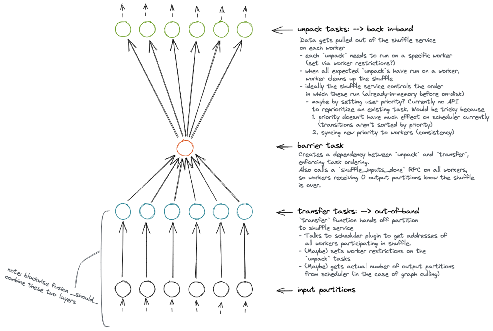

# Peer-to-peer DataFrame shuffling

This is a proposal for the high-level design of an extension built into distributed for shuffling very large DataFrames reliably and performantly. It does so by transferring data between workers out-of-band (not managed by the scheduler) using stateful worker extensions. This significantly reduces the size of the graph and eliminates the scheduler as a bottleneck, compared to the current task-based shuffle.

This work builds off the proof-of-concept in https://github.com/dask/dask/pull/8223.

## Motivation

Shuffles are an integral part of most DataFrame workloads, as part of a `merge`, `set_index`, or `groupby().apply()`. Shuffling is a poor fit for centralized graph-based scheduling, since the graph is all-to-all (O(N²) in size), yet the logic is so simple, it gets little benefit from centralized coordination, while suffering significant overhead from it. With task-based shuffles, the amount of data we can shuffle effectively (before workers run out of memory, or the scheduler crashes, or both) is severely limited. By allowing workers to autonomously exchange data with their peers, and manage disk and memory usage in a more fine-grained way, that limit becomes significantly higher.

See https://coiled.io/blog/better-shuffling-in-dask-a-proof-of-concept/ for more background.

## Goals and non-goals

End goals:
* Can reliably shuffle orders-of-magnitude larger datasets (in total size and number of partitions) than the current task-based shuffle
* Maintainable, thoroughly tested code using (or adding) public APIs
* Can shuffle larger-than-memory datasets by spilling to disk
* Constant, predictable memory footprint per worker, which scales linearly with partition size, not total number of partitions
* Just works, without users needing to tune parameters (buffer sizes, etc.)
* Graceful restarting when possible, and quick failure when not
* All state is cleaned up on success, failure, or cancellation
* Shuffle performance is IO-bound (network, disk)

Non-goals:
* Utilize new workers that enter the cluster midway though a shuffle
* Resilience via data duplication (a shuffle can continue through losing some number of workers)
* Worker loss only requires partial re-transfer of data

## Plan

The implementation will be completed in multiple stages (order TBD after #1):
1. Establish the patterns for how this out-of-band system will interact with distributed, in the simplest possible implementation with no optimizations.
1. Retries (shuffle restarts automatically if a worker leaves)
1. Improve performance with concurrency if possible
1. Spill-to-disk
1. Backpressure
1. Performance

## Design

Here we'll discuss the highest-level architectural components of the shuffling system.

_Note: unlike the POC PR, we propose keeping this code in `dask/distributed`, not `dask/dask`. The implementation will be somewhat dependent on worker internals, so internal changes in `distributed` are far more likely to break things than changes in `dask`. We'd like tests to fail (and fixes to happen) in the same repo as the changes that break things. Plus, the code is very `distributed`-specific anyway._

### Task graph

The whole point of a peer-to-peer shuffle using a separate worker extension is to not have to capture the full operation in a dask graph.
Therefore, the primary purpose of the graph is to mediate between dask-managed data and out-of-band processing:
- Hand off dask-managed data to be processed by the extension
- Bring data produced out-of-band back into dask
- Clean up when keys depending on the shuffle are cancelled

The graph also has a secondary synchronization benefit, letting us bypass some difficult distributed problems (exactly-once initialization and cleanup tasks, determining when all peer-to-peer transfers are complete) by leaning on the scheduler.



### `ShuffleExtension`

Problems to solve:
* Holding per-worker out-of-band state for an in-progress shuffle
* Adding new handlers in an organized way for workers to transfer shuffle data
* Doing the above cleanly with multiple concurrent shuffles (`merge`)
* Coordinating multiple concurrent shuffles which may need to share limited resources (memory, threads, etc.)
* Getting metrics back to the scheduler/dashboard, like managed memory & bytes spilled to disk (eventually)

The `ShuffleExtension` will be built into distributed and added to workers automatically (like the `PubSubWorkerExtension`). It'll add a route to the worker; something like:

```python
def shuffle_receive(comm, shuffle_id: str, data: DataFrame) -> None:
    """
    Receive an incoming shard of data from a peer worker.
    Using an unknown ``shuffle_id`` will first initialize any state needed for that new shuffle.
    """
    ...
```

The `ShuffleExtension` will hold all per-shuffle state and buffers specific to that worker. For example, things like (will vary depending on the stage of the implementation):
- a buffer of received shards
- a buffer of outgoing shards (waiting to accumulate enough to be worth sending to a worker)
- a datastore that transparently spills received shards to disk
- locks or synchronization mechanisms

The `ShuffleExtension` will also hold any global state shared by all shuffles, such as worker threads or coroutines.

Most of the implementation-specific logic will happen in the `ShuffleExtension`. As we improve performance, add concurrency, etc., this code will change the most (though the interface will likely not).

The `transfer` tasks will pass their input partitions into the `ShuffleExtension`, blocking the task until the extension is ready to receive another input. Internally, the extension will do whatever it needs to do to transfer the data, using worker comms to call the `shuffle_receive` RPC on peer workers. Simultaneously, it'll handle any incoming data from other workers.

### Retries and cancellation

Problems to solve:
* Causing all tasks in the shuffle to rerun when a worker leaves
* Cleaning up out-of-band state when a user cancels a shuffle, or it errors

Because most the tasks in the shuffle graph are impure and run for their side effects, restarting an in-progress shuffle requires rerunning _every_ task involved, even ones that appear to have successfully transitioned to `memory` and whose "results" are stored on non-yet-dead workers.

Additionally, cleanly stopping a running shuffle takes more than just releasing the shuffle tasks from memory: since there's out-of-band processing going on, the `ShuffleExtension` has to be informed in some way that it needs to stop doing whatever it's doing in the background, and clear out its buffers. Also, executing tasks may be blocking on the `ShuffleExtension` doing something; without a way to tell the extension to shut down, those tasks might block forever, deadlocking the cluster.

Therefore, we propose adding a `RerunGroup` (`ImpureGroup`? `CoExecutionGroup`? `RestartGroup`? `OutOfBandGroup`? name TBD) structure to the scheduler which intertwines the fates of all tasks within it: if any one task is to be rescheduled (due to its worker leaving), all tasks are restarted; if any one is to be prematurely released (due to cancellation), all are released.

Membership in a `RerunGroup` is implemented via task annotations, where each task gives the name of the `RerunGroup` it belongs to. A task can belong to at most one `RerunGroup`. TBD if we will enforce any structural restrictions on `RerunGroup`s to prevent odd/invalid states from emerging—we probably should, such as not allowing disjoint parts of the graph to be in the same `RerunGroup`, etc.

Additionally, the scheduler informs workers whenever a `RerunGroup` is restarted or cancelled. Workers will have a way to pass this information on to any interested out-of-band operations. This could be something like:
- Workers have a named `threading.Event` for each `RerunGroup` that any of their current tasks belong to. When the scheduler tells workers about a restart/cancellation, they `set()` the corresponding event so that some background thread can respond accordingly.
- A `register_cancellation_handler(rerun_group: str, async_callback: Callable)` method on workers that registers an async function to be run when that group is cancelled/restarted. A potential upside (and potential deadlock) is that the scheduler's `cancel_rerun_group` RPC to workers could block on this callback completing, meaning the scheduler wouldn't treat the `RerunGroup` as successfully cancelled until every callback on every worker succeeded. That could give us some nice synchronization guarantees (which we may or many not actually need) ensuring a shuffle doesn't try to restart while it's also trying to shut down.

### Peer discovery and initialization

Problems to solve:
* Workers need to all have the same list of peers participating in the shuffle (otherwise data could end up in two different places!)
* Scheduler needs to be told where to run the `unpack` tasks which bring data back in-band

We'll run a single `shuffle-setup` task before all the transfers to do some initialization.

First, it will ask the scheduler for the addresses of all workers that should participate in the shuffle (taking into account worker or resource restrictions). How this will be implemented is TBD.

Next, it will set worker restrictions on the `unpack` tasks, so each task will run on the worker that will receive that output partition. (This is computed just by binning the number of output partitions into the number of workers.) Note that we could also do this step in the barrier task; just seems nicer and potentially a tiny bit less overhead to do all scheduler comms in one place.

It'll return the list of worker addresses. This will be input to all the `transfer` tasks, which use the same binning logic to decide where to send a given row of each input partition.

Since this `shuffle-setup` task will be part of the `RerunGroup`, every time the shuffle is restarted, we'll recompute these peer addresses (accounting for any lost or gained workers) and reset any now-invalid worker restrictions on the `unpack` tasks (preventing deadlocks from waiting to schedule a task on a worker that doesn't exist).

Also possibly (TBD) `shuffle-setup` could call an RPC on all the other workers informing them that a shuffle is about to happen. This is most likely unnecessary, but in case there are some resources that need to be initialized before any data moves around, this would give us an easy way to do it.

### Spilling to disk

Problems to solve:
* ...

I'll let Florian fill this one in from discussion notes at https://docs.google.com/document/d/19tpd0pZgt969rXIPRfc7tulB7hzATCJ8m_MlDdsFpGg/edit?usp=sharing.

## Appendix

### Data-transfer diagrams

Some pretty pictures of the principle behind the data transfer:


