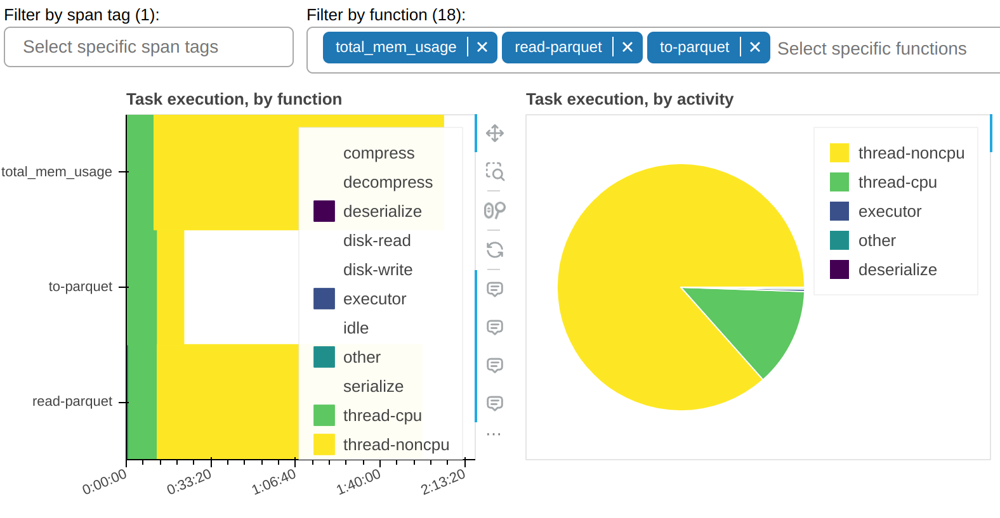
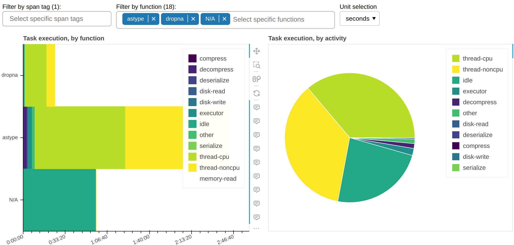

Fine Performance Metrics
========================
.. note::

    This is an experimental feature and may rapidly change without a deprecation cycle.

You may want to investigate where your Dask workload spends the majority of its time;
not only on which tasks, but also *doing what* while running said tasks.
Dask automatically collects *fine performance metrics* to answer this question by
breaking down the end-to-end runtime of a computation by task and, within each task, by
a series of *activities* taken to complete it.

In order to observe these metrics, you can simply

#. run your workload end-to-end
#. open the Dask dashboard (default for a LocalCluster: `<http://localhost:8787>`_)
#. select ``More...`` -> ``Fine Performance Metrics``

Alternatively, if you're using Jupyter Lab and `dask-labextension
<https://github.com/dask/dask-labextension>`_, you can just drag the
``Fine Performance Metrics`` widget onto your Jupyter dashboard.

.. image:: images/fine-performance-metrics/seconds-full.png
   :alt: Populated Fine Performance Metrics dashboard

The central panel (**Task execution, by activity**) shows what *activities* the cluster
spent its time on, cumulatively for all currently-visible functions. The most important
ones are:

``thread-cpu``
  CPU time spent by tasks while running on workers. This is typically "good" time; in
  other words it's the same time you would have spent if you ran the workload serially
  on a single CPU - but parallelized over however how many CPUs are available on
  your cluster.
``thread-noncpu``
  Difference between wall clock time and CPU time spent by tasks while running on
  workers. This is typically I/O time, GPU time, CPU contention, or GIL contention.
  If you observe large amounts of this in your overall workload, you probably want to
  break it down by function and isolate those that are known to perform I/O or GPU
  activity.
``idle``
  Time where a worker had a free thread, but nothing to run on it. This is typically
  caused by the workload not being able to fully utilize all threads on the cluster,
  network latency between scheduler and workers, or excessive CPU load on the scheduler.
  This measure does not include time spent while the whole cluster was completely idle.
``disk-read``, ``disk-write``, ``compress``, ``decompress``
  Time spent spilling/unspilling to disk due to not having enough memory available.
  See :doc:`worker-memory`.
``executor``, ``offload``, ``other``
  This is overhead from the Dask code and should be typically negligible. However,
  it can be inflated by GIL contention and by spill/unspill activity.

The grand total of the time shown should roughly add up to the end-to-end runtime of
your workload, multiplied by the number of threads on the cluster.

The left panel (**Task execution, by function**) shows the same information as the
central one, but broken down by function.

The right panel (**Send data, by activity**) shows network transfer time. Note that most
of it should be pipelined with task execution, so it may not have an impact. You should
worry about this only if you have a very large ``idle`` time.

There is a filter that allows you to show only selected functions. In the sample
screenshots, you can observe that most of the `thread-noncpu` time is concentrated - as
expected - in functions that are known to be I/O heavy. Here they are singled out:

And here's all other functions that take a non-trivial amount of time:

This tells us an important piece of information: why is `astype`, which is a pure CPU
function, spending so much time occupying workers' threads but without accruing any CPU
time? The answer, almost certainly, it's that it doesn't properly release the GIL.

Fine Performance Metrics collect more than wall clock timings. We can change the
unit to bytes:

The above gives us insights on spill/unspill activity (see :doc:`worker-memory`).
In this workflow, in 99% of the cases there was enough RAM to accommodate all the data
and it was unnecessary to retrieve it from disk; in other words we have *cache hits* for
99% of the data, which means that we would not get any benefit if we increased RAM, but
we would likely start seeing slowdowns if we reduced it.

Are task prefixes enough?
-------------------------
Individual task prefixes may be too granular; vice versa, the same task prefix may
appear in very different sections of the workflow. Your codebase may be complex enough
that it's not straightforward to pinpoint the client code that's responsible for a
specific task prefix.

:doc:`spans` let you break down these metrics into macro-blocks (e.g. data load,
preprocessing, etc.).

API for advanced users
----------------------
For the most part, fine performance metrics just work; as a user, you don't need to
change your client code.

If you run custom tasks on the cluster (e.g. via :meth:`~distributed.Client.submit`,
:meth:`~dask.array.Array.map_blocks`, or
:meth:`~dask.dataframe.DataFrame.map_partitions`), you may want to customize the metrics
they produce. For example, you may want to separate I/O time from `thread-noncpu`:

.. code-block:: python

   from distributed.metrics import context_meter

   @context_meter.meter("I/O")
   def read_some_files():
       ...

   future = client.submit(read_some_files)

In the above example, the wall time spent by the custom function ``read_some_files``
will be logged as "I/O", which is a completely arbitrary activity label.

Alternatively you may want to just label some of the time this way:

.. code-block:: python

   def read_some_files():
       with context_meter.meter("I/O"):
           data = read_from_network(...)
       return preprocess(data)

In the above example, the function is split into an I/O intensive phase,
``read_from_network``, and a CPU-intensive one, ``preprocess``. The
:meth:`distributed.metrics.context_meter.meter` context manager will log the time spent
by ``read_from_network`` as ``I/O``, whereas the time spent by ``preprocess`` still be
logged as a mix of ``thread-cpu`` and ``thread-noncpu`` (the latter may, for example,
highlight GIL contention).

.. note::
   The :meth:`distributed.metrics.context_meter.meter` context manager wraps around code
   that runs on the worker, in a single task. It won't work if used to decorate
   client-side code that defines the Dask graph. See :doc:`spans` for that.

Finally, you may want to report a metric that is not just wall time. For example, if
you're reading data from S3 Infrequent Access storage, you may want to keep track of it
to understand your spending:

.. code-block:: python

   def read_some_files():
       data = read_from_network(...)
       context_meter.digest_metric("S3 Infrequent Access", sizeof(data), "bytes")
       return data

Again, "S3 Infrequent Access" is a completely arbitrary activity label, and "bytes" is
a completely arbitrary unit of measure.

.. autofunction:: distributed.metrics.context_meter.digest_metric
.. autofunction:: distributed.metrics.context_meter.meter

Developer specifications
------------------------
.. admonition:: Intended audience

    This section is only of interest to developers maintaining Dask or writing scheduler
    extensions, e.g. to create an alternative dashboard or to store metrics long-term.

Fine Performance metrics are collected:

- On each worker
- On the scheduler, globally
- On the :doc:`spans`

On the workers, they are collected through :meth:`distributed.core.Server.digest_metric`
and stored in the ``Worker.digests_total`` mapping.

They are stored in this format:

- ``("execute", span_id, task_prefix, activity, unit): value``
- ``("gather-dep", activity, unit): value``
- ``("get-data", activity, unit): value``
- ``("memory-monitor", activity, unit): value``

At every heartbeat, they are synchronized to the scheduler, where they populate the
``Scheduler.cumulative_worker_metrics`` mapping, in this format:

- ``("execute", task_prefix, activity, unit): value``
- ``("gather-dep", activity, unit): value``
- ``("get-data", activity, unit): value``
- ``("memory-monitor", activity, unit): value``

As ``execute`` metrics have no span_id here, multiple records from the worker may have
been added up on a single one on the scheduler.

The ``execute`` metrics can also be found, disaggregated, on the :doc:`spans` at
``Scheduler.extensions["spans"].spans[span_id].cumulative_worker_metrics``, in this
format:

- ``("execute", task_prefix, activity, unit): value``

Notes
~~~~~
- In both ``Worker.digests_total`` and ``Scheduler.cumulative_worker_metrics``, you
  will also find keys unrelated to fine performance metrics, which are not necessarily
  tuples.
- Due to custom metrics (see previous section), ``activity`` is going to be *most
  times*, but not *always*, a string.
- Even barring custom metrics, more fine-grained activities may be added in the future,
  so it's never a good idea to implement hardcoded tests for them.
