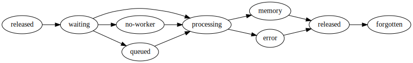

Scheduler State Machine
=======================

.. currentmodule:: distributed.scheduler

Overview
--------

The life of a computation with Dask can be described in the following stages:

1.  The user authors a graph using some library, perhaps dask.delayed or
    dask.dataframe or the ``submit/map`` functions on the client.  They submit
    these tasks to the scheduler.
2.  The scheduler assimilates these tasks into its graph of all tasks to
    track, and as their dependencies become available it asks workers to run
    each of these tasks in turn.
3.  The worker receives information about how to run the task, communicates
    with its peer workers to collect data dependencies, and then runs the
    relevant function on the appropriate data.  It reports back to the
    scheduler that it has finished, keeping the result stored in the worker
    where it was computed.
4.  The scheduler reports back to the user that the task has completed.  If the
    user desires, it then fetches the data from the worker through the
    scheduler.

Most relevant logic is in tracking tasks as they evolve from newly submitted,
to waiting for dependencies, to actively running on some worker, to finished in
memory, to garbage collected.  Tracking this process, and tracking all effects
that this task has on other tasks that might depend on it, is the majority of
the complexity of the dynamic task scheduler.  This section describes the
system used to perform this tracking.

For more abstract information about the policies used by the scheduler, see
:doc:`Scheduling Policies<scheduling-policies>`.

The scheduler keeps internal state about several kinds of entities:

* Individual tasks known to the scheduler
* Workers connected to the scheduler
* Clients connected to the scheduler

.. note::
   Everything listed in this page is an internal detail of how Dask operates.
   It may change between versions and you should probably avoid relying on it
   in user code (including on any APIs explained here).

.. _scheduler-task-state:

Task State
----------

Internally, the scheduler moves tasks between a fixed set of states,
notably ``released``, ``waiting``, ``no-worker``, ``queued``, ``processing``,
``memory``, ``error``.

Tasks flow along the following states with the following allowed transitions:

Note that tasks may also transition to ``released`` from any state (not shown on diagram).

released
    Known but not actively computing or in memory
waiting
    On track to be computed, waiting on dependencies to arrive in memory
no-worker
    Ready to be computed, but no appropriate worker exists (for example because of
    resource restrictions, or because no worker is connected at all).
queued
    Ready to be computed, but all workers are already full.
processing
    All dependencies are available and the task is assigned to a worker for compute (the
    scheduler doesn't know whether it's in a worker queue or actively being computed).
memory
    In memory on one or more workers
erred
    Task computation, or one of its dependencies, has encountered an error
forgotten
    Task is no longer needed by any client or dependent task, so it disappears from the
    scheduler as well. As soon as a task reaches this state, it is immediately
    dereferenced from the scheduler.

.. note::
    When the ``distributed.scheduler.worker_saturation`` config value is set to ``inf``
    (default), there's no intermediate state between ``waiting`` / ``no-worker`` and
    ``processing``: as soon as a task has all of its dependencies in memory somewhere on
    the cluster, it is immediately assigned to a worker. This can lead to very long task
    queues on the workers, which are then rebalanced dynamically through
    :doc:`work-stealing`.

    Setting ``distributed.scheduler.worker_saturation`` to ``1.0`` (or any finite value)
    will instead queue excess root tasks on the scheduler in the ``queued`` state. These
    tasks are only assigned to workers when they have capacity for them, reducing the
    length of task queues on the workers.

In addition to the literal state, though, other information needs to be
kept and updated about each task.  Individual task state is stored in an
object named :class:`TaskState`; see full API through the link.

The scheduler keeps track of all the :class:`TaskState` objects (those
not in the "forgotten" state) using several containers:

.. attribute:: tasks: {str: TaskState}

   A dictionary mapping task keys (always strings) to :class:`TaskState`
   objects.  Task keys are how information about tasks is communicated
   between the scheduler and clients, or the scheduler and workers; this
   dictionary is then used to find the corresponding :class:`TaskState`
   object.

.. attribute:: unrunnable: {TaskState}

   A set of :class:`TaskState` objects in the "no-worker" state.  These
   tasks already have all their :attr:`~TaskState.dependencies` satisfied
   (their :attr:`~TaskState.waiting_on` set is empty), and are waiting
   for an appropriate worker to join the network before computing.

Once a task is queued up on a worker, it is also tracked on the worker side by the
:doc:`worker-state`.

Worker State
------------

Each worker's current state is stored in a :class:`WorkerState` object; see full API
through the link.

This is a scheduler-side object, which holds information about what the scheduler
knows about each worker on the cluster, and is not to be confused with
:class:`distributed.worker-state-machine.WorkerState`.

This information is involved in deciding
:ref:`which worker to run a task on <decide-worker>`.

In addition to individual worker state, the scheduler maintains two
containers to help with scheduling tasks:

.. attribute:: Scheduler.saturated: {WorkerState}

   A set of workers whose computing power (as
   measured by :attr:`WorkerState.nthreads`) is fully exploited by processing
   tasks, and whose current :attr:`~WorkerState.occupancy` is a lot greater
   than the average.

.. attribute:: Scheduler.idle: {WorkerState}

   A set of workers whose computing power is not fully exploited.  These
   workers are assumed to be able to start computing new tasks immediately.

These two sets are disjoint.  Also, some workers may be *neither* "idle"
nor "saturated".  "Idle" workers will be preferred when
:ref:`deciding a suitable worker <decide-worker>` to run a new task on.
Conversely, "saturated" workers may see their workload lightened through
:doc:`work-stealing`.

Client State
------------

Information about each individual client of the scheduler is kept
in a :class:`ClientState` object; see full API through the link.

Understanding a Task's Flow
---------------------------

As seen above, there are numerous pieces of information pertaining to
task and worker state, and some of them can be computed, updated or
removed during a task's transitions.

The table below shows which state variable a task is in, depending on the
task's state.  Cells with a check mark (`✓`) indicate the task key *must*
be present in the given state variable; cells with an question mark (`?`)
indicate the task key *may* be present in the given state variable.

================================================================ ======== ======= ========= ========== ====== =====
State variable                                                   Released Waiting No-worker Processing Memory Erred
================================================================ ======== ======= ========= ========== ====== =====
:attr:`TaskState.dependencies`                                   ✓        ✓       ✓         ✓          ✓      ✓
:attr:`TaskState.dependents`                                     ✓        ✓       ✓         ✓          ✓      ✓
---------------------------------------------------------------- -------- ------- --------- ---------- ------ -----
:attr:`TaskState.host_restrictions`                              ?        ?       ?         ?          ?      ?
:attr:`TaskState.worker_restrictions`                            ?        ?       ?         ?          ?      ?
:attr:`TaskState.resource_restrictions`                          ?        ?       ?         ?          ?      ?
:attr:`TaskState.loose_restrictions`                             ?        ?       ?         ?          ?      ?
---------------------------------------------------------------- -------- ------- --------- ---------- ------ -----
:attr:`TaskState.waiting_on`                                              ✓                 ✓
:attr:`TaskState.waiters`                                                 ✓                 ✓
:attr:`TaskState.processing_on`                                                             ✓
:attr:`WorkerState.processing`                                                              ✓
:attr:`TaskState.who_has`                                                                              ✓
:attr:`WorkerState.has_what`                                                                           ✓
:attr:`TaskState.nbytes` *(1)*                                   ?        ?       ?         ?          ✓      ?
:attr:`TaskState.exception` *(2)*                                                                             ?
:attr:`TaskState.traceback` *(2)*                                                                             ?
:attr:`TaskState.exception_blame`                                                                             ✓
:attr:`TaskState.retries`                                        ?        ?       ?         ?          ?      ?
:attr:`TaskState.suspicious_tasks`                               ?        ?       ?         ?          ?      ?
================================================================ ======== ======= ========= ========== ====== =====

Notes:

1. :attr:`TaskState.nbytes`: this attribute can be known as long as a
   task has already been computed, even if it has been later released.

2. :attr:`TaskState.exception` and :attr:`TaskState.traceback` should
   be looked up on the :attr:`TaskState.exception_blame` task.

The table below shows which worker state variables are updated on each
task state transition.

==================================== ==========================================================
Transition                           Affected worker state
==================================== ==========================================================
released → waiting                   occupancy, idle, saturated
waiting → processing                 occupancy, idle, saturated, used_resources
waiting → memory                     idle, saturated, nbytes
processing → memory                  occupancy, idle, saturated, used_resources, nbytes
processing → erred                   occupancy, idle, saturated, used_resources
processing → released                occupancy, idle, saturated, used_resources
memory → released                    nbytes
memory → forgotten                   nbytes
==================================== ==========================================================

.. note::
   Another way of understanding this table is to observe that entering or
   exiting a specific task state updates a well-defined set of worker state
   variables.  For example, entering and exiting the "memory" state updates
   :attr:`WorkerState.nbytes`.

.. _scheduling_state_implementation:

Implementation
--------------

Every transition between states is a separate method in the scheduler.  These
task transition functions are prefixed with ``transition`` and then have the
name of the start and finish task state like the following.

.. code-block:: python

   def transition_released_waiting(self, key, stimulus_id): ...

   def transition_processing_memory(self, key, stimulus_id): ...

   def transition_processing_erred(self, key, stimulus_id): ...

These functions each have three effects.

1.  They perform the necessary transformations on the scheduler state (the 20
    dicts/lists/sets) to move one key between states.
2.  They return a dictionary of recommended ``{key: state}`` transitions to
    enact directly afterwards on other keys. For example, after we transition a
    key into memory, we may find that many waiting keys are now ready to
    transition from waiting to a ready state.
3.  Optionally, they include a set of validation checks that can be turned on
    for testing.

Rather than call these functions directly we call the central function
``transition``:

.. code-block:: python

   def transition(self, key, final_state, stimulus_id): ...

This transition function finds the appropriate path from the current to the
final state.  It also serves as a central point for logging and diagnostics.

Often we want to enact several transitions at once or want to continually
respond to new transitions recommended by initial transitions until we reach a
steady state.  For that we use the ``transitions`` function (note the plural ``s``).

.. code-block:: python

   def transitions(self, recommendations, stimulus_id):
       recommendations = recommendations.copy()
       while recommendations:
           key, finish = recommendations.popitem()
           new = self.transition(key, finish)
           recommendations.update(new)

This function runs ``transition``, takes the recommendations and runs them as
well, repeating until no further task-transitions are recommended.

Stimuli
-------

Transitions occur from stimuli, which are state-changing messages to the
scheduler from workers or clients.  The scheduler responds to the following
stimuli:

**Workers**

task-finished
    A task has completed on a worker and is now in memory
task-erred
    A task ran and erred on a worker
reschedule
    A task has completed on a worker by raising :class:`~distributed.Reschedule`
long-running
    A task is still running on the worker, but it called :func:`~distributed.secede`
add-keys
    Replication finished. One or more tasks, which were previously in memory on other
    workers, are now in memory on one additional worker. Also used to inform the
    scheduler of a successful :func:`~distributed.Client.scatter` operation.
request-refresh-who-has
    All peers that hold a replica of a task in memory that a worker knows of are
    unavailable (temporarily or permanently), so the worker can't fetch it and is asking
    the scheduler if it knows of any additional replicas. This call is repeated
    periodically until a new replica appears.
release-worker-data
    A worker informs that the scheduler that it no longer holds the task in memory
worker-status-change
    The global status of a worker has just changed, e.g. between ``running`` and
    ``paused``.
log-event
    A generic event happened on the worker, which should be logged centrally.
    Note that this is in addition to the worker's log, which the client can fetch on
    request (up to a certain length).
keep-alive
    A worker informs that it's still online and responsive. This uses the batched stream
    channel, as opposed to :meth:`distributed.worker.Worker.heartbeat` and
    :meth:`Scheduler.heartbeat_worker` which use dedicated RPC comms, and is needed to
    prevent firewalls from closing down the batched stream.
register-worker
    A new worker was added to the network
unregister
    An existing worker left the network

**Clients**

update-graph
    The client sends more tasks to the scheduler
client-releases-keys
    The client no longer desires the result of certain keys.

Note that there are many more client API endpoints (e.g. to serve
:func:`~distributed.Client.scatter` etc.), which are not listed here for the sake of
brevity.

Stimuli functions are prepended with the text ``stimulus``, and take a variety
of keyword arguments from the message as in the following examples:

.. code-block:: python

   def stimulus_task_finished(self, key=None, worker=None, nbytes=None,
                              type=None, compute_start=None, compute_stop=None,
                              transfer_start=None, transfer_stop=None):

   def stimulus_task_erred(self, key=None, worker=None,
                           exception=None, traceback=None)

These functions change some non-essential administrative state and then call
transition functions.

Note that there are several other non-state-changing messages that we receive
from the workers and clients, such as messages requesting information about the
current state of the scheduler.  These are not considered stimuli.

API
---

.. autoclass:: Scheduler
   :members:
   :inherited-members:

.. autoclass:: TaskState
    :members:

.. autoclass:: WorkerState
    :members:

.. autoclass:: ClientState
    :members:

.. autofunction:: decide_worker

.. autoclass:: MemoryState
    :members:
