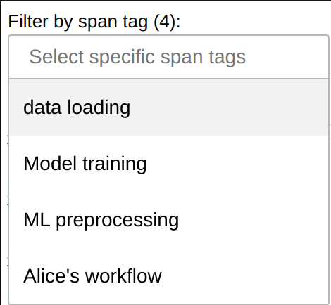

Spans
=====
.. currentmodule:: distributed

.. note::

    This is an experimental feature and may rapidly change without a deprecation cycle.

Dask offers various diagnostics and :doc:`fine-performance-metrics` about tasks,
grouping them by their prefix (commonly, the name of the function being called). This
can be suboptimal:

- your client code may be sophisticated enough that correlating lines on the client and
  tasks being run on the cluster may prove difficult;
- the same function may be applied to different parts of your workflow, with a different
  performance profile;
- you may be in a multitenancy setup, where part of the load on the cluster was not
  caused by your client code.

In these situations, it may be useful to attach meaningful tags to your workflow, or
segments of it.
To do so, you should use the :func:`span` context manager inside the client code.

For example:

.. code-block:: python

    import dask.config
    import dask.dataframe as dd
    from distributed import Client, span

    dask.config.set({"optimization.fuse.active": False})
    client = Client()

    with span("Alice's workflow"):
        with span("data load"):
            df = dd.read_parquet(...)

        with span("ML preprocessing"):
            df = preprocess(df)

        with span("Model training"):
            model = train(df)

    model = model.compute()

Note how the :func:`span` context manager can be nested.
The example will create the following spans on the scheduler:

- ``("Alice's workflow", )``
- ``("Alice's workflow", "data load")``
- ``("Alice's workflow", "ML preprocessing")``
- ``("Alice's workflow", "Model training")``

Each of the spans will be mapped to the tasks matching the segment of the graph that was
defined inside its context manager. The parent span will be mapped to all tasks of its
children.

Tags are arbitrary and nothing stops you from parameterizing them; for example

>>> with span(f"{user}'s workflow"):
...     ...

Which may give you

- ``("Alice's workflow", "data load")``
- ``("Bob's workflow", "data load")``
- etc.

This is useful for example if you want to observe either all the workload
submitted by Alice, while hiding Bob's activity, or alternatively all the data loading
activity, regardless of who submitted it.

The possibilities are more or less endless - instead *or in addition to* a username at
the top, you could store information on what dataset you're processing, etc.

The default span
----------------
If you don't use the :func:`span` context manager, your tasks will be automatically
attributed to the ``("default", )`` span.

Viewing the spans
-----------------
You can filter by span tags in the :doc:`fine-performance-metrics` dashboard widget to
filter your workload:

Additionally, spans can be queried using scheduler extensions or
:meth:`~distributed.Client.run_on_scheduler`; see :ref:`spans_developer_api`.

User API
--------
.. warning::

    Spans are based on annotations, and just like annotations they can be lost during
    optimization. To prevent this issue, you must set

    >>> dask.config.set({"optimization.fuse.active": False})

    Or in dask.yaml:

    .. code-block:: yaml

        optimization:
          fuse:
            active: false

.. autofunction:: span

.. _spans_developer_api:

Dask Developer API
------------------
.. currentmodule:: distributed.spans

.. admonition:: Intended audience

    This section is only of interest to developers maintaining Dask or writing scheduler
    extensions, e.g. to create an alternative dashboard or to store metrics long-term.

Spans can be accessed on the scheduler through ``Scheduler.extensions["spans"]``, which
contains a singleton instance of :class:`SpansSchedulerExtension`. In turn, the
extension contains a mapping of all :class:`Span` objects, plus a variety of convenience
methods to access and aggregate them.

Note how :class:`Span` objects offer a variety of methods that the dashboard currently
doesn't use - such as start/stop times, tasks counts, and size of the output.

.. autoclass:: Span
   :members:

.. autoclass:: SpansSchedulerExtension
   :members:

.. autoclass:: SpansWorkerExtension
   :members:
