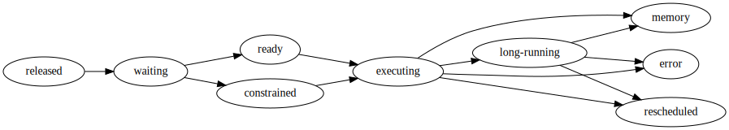
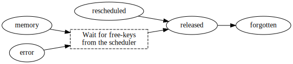

Worker State Machine
====================

.. currentmodule:: distributed.worker_state_machine

Task states
-----------

When the Scheduler asks a Worker to compute a task, it is tracked by the Worker through
a :class:`distributed.worker_state_machine.TaskState` object - not to be confused with
the matching scheduler-side class :class:`distributed.scheduler.TaskState`.

The class has a key attribute, :attr:`TaskState.state`, which can assume the following
values:

released
    Known but not actively computing or in memory. A task can stay in this state when
    the scheduler asked to forget it, but it has dependent tasks on the same worker.
waiting
    The scheduler has added the task to the worker queue. All of its dependencies are
    in memory somewhere on the cluster, but not all of them are in memory on the current
    worker, so they need to be fetched.
fetch
    This task is in memory on one or more peer workers, but not on this worker. Its data
    is queued to be transferred over the network, either because it's a dependency of a
    task in ``waiting`` state, or because the :doc:`active_memory_manager` requested it
    to be replicated here.
    The task can be found in the :attr:`WorkerState.data_needed` heap.
missing
    Like ``fetch``, but all peer workers that were listed by the scheduler are either
    unreachable or have responded they don't actually have the task data. The worker
    will periodically ask the scheduler if it knows of additional replicas; when it
    does, the task will transition again to ``fetch``.
    The task can be found in the :attr:`WorkerState.missing_dep_flight` set.
flight
    The task data is currently being transferred over the network from another worker.
    The task can be found in the :attr:`WorkerState.in_flight_tasks` and
    :attr:`WorkerState.in_flight_workers` collections.
ready
    The task is ready to be computed; all of its dependencies are in memory on the
    current worker and it's waiting for an available thread.
    The task can be found in the :attr:`WorkerState.ready` heap.
constrained
    Like ``ready``, but the user specified :doc:`resource constraints <resources>` for
    this task.
    The task can be found in the :attr:`WorkerState.constrained` queue.
executing
    The task is currently being computed on a thread.
    It can be found in the :attr:`WorkerState.executing` set and in the
    :attr:`distributed.worker.Worker.active_threads` dict.
long-running
    Like ``executing``, but the user code called :func:`distributed.secede` so the task
    no longer counts towards the maximum number of concurrent tasks.
    It can be found in the :attr:`WorkerState.long_running` set and in the
    :attr:`distributed.worker.Worker.active_threads` dict.
rescheduled
    The task just raised the :class:`~distributed.Reschedule` exception. This is a
    transitory state, which is not stored permanently.
cancelled
    The scheduler asked to forget about this task, but it's technically impossible at
    the moment. See :ref:`cancelled-tasks`. The task can be found in whatever
    collections it was in its :attr:`~TaskState.previous` state.
resumed
    The task was recovered from ``cancelled`` state. See :ref:`cancelled-tasks`.
    The task can be found in whatever collections it was in its
    :attr:`~TaskState.previous` state.
memory
    Task execution completed, or the task was successfully transferred from another
    worker, and is now held in either :class:`WorkerState.data` or
    :class:`WorkerState.actors`.
error
    Task execution failed. Alternatively, task execution completed successfully, or the
    task data transferred successfully over the network, but it failed to serialize or
    deserialize. The full exception and traceback are stored in the task itself, so that
    they can be re-raised on the client.
forgotten
    The scheduler asked this worker to forget about the task, and there are neither
    dependents nor dependencies on the same worker. As soon as a task reaches this
    state, it is immediately dereferenced from the :class:`WorkerState` and will be soon
    garbage-collected. This is the only case where two instances of a :class:`TaskState`
    object with the same :attr:`~TaskState.key` can (transitorily) exist in the same
    interpreter at the same time.

Fetching dependencies
---------------------

.. image:: images/worker-dep-state.svg
    :alt: Worker states for dependencies

As tasks that need to be computed arrive on the Worker, any dependencies that are not
already in memory on the same worker are wrapped by a :class:`TaskState` object and
contain a listing of workers (:attr:`TaskState.who_has`) to collect their result from.

These :class:`TaskState` objects have their state set to ``fetch``, are put in the
:attr:`~WorkerState.data_needed` heap, and are progressively transferred over the
network. For each dependency we select a worker at random that has that data and collect
the dependency from that worker. To improve bandwidth, we opportunistically gather other
dependencies of other tasks that are known to be on that worker, up to a maximum of 50MB
of data (:attr:`~WorkerState.transfer_message_bytes_limit`, which is acquired from the
configuration key ``distributed.worker.transfer.message-bytes-limit``) - too little data
and bandwidth suffers, too much data and responsiveness suffers. We use a fixed number of
50 connections (:attr:`~WorkerState.transfer_incoming_count_limit`, which is in turn
acquired from the configuration key ``distributed.worker.connections.outgoing``) so as
to avoid overly-fragmenting our network bandwidth.

In the event that the network comms between two workers are saturated, a dependency task
may cycle between ``fetch`` and ``flight`` until it is successfully collected. It may
also happen that a peer worker responds that it doesn't have a replica of the requested
data anymore; finally, the peer worker may be unreachable or unresponsive. When that
happens, the peer is removed from :attr:`~TaskState.who_has` and the task is
transitioned back to ``fetch``, so that the Worker will try gathering the same key from
a different peer. If :attr:`~TaskState.who_has` becomes empty due to this process, the
task transitions to ``missing`` and the Worker starts periodically asking the Scheduler
if additional peers are available.

The same system used for fetching dependencies is also used by
:doc:`active_memory_manager` replication.

.. note::
   There is at most one :meth:`~BaseWorker.gather_dep` asyncio task running at any
   given time for any given peer worker. If all workers holding a replica of a task
   in ``fetch`` state are already in flight, the task will remain in ``fetch`` state
   until a worker becomes available again.

Computing tasks
---------------
A :class:`TaskState` that needs to be computed proceeds on the Worker through the
following pipeline. It has its :attr:`~TaskState.run_spec` defined, which instructs the
worker how to execute it.

After all dependencies for a task are in memory, the task transitions from ``waiting``
to ``ready`` or ``constrained`` and is added to the :attr:`~WorkerState.ready` heap.

As soon as a thread is available, we pop a task from the top of the heap and put the
task into a thread from a local thread pool to execute.

Optionally, while it's running, this task may identify itself as a long-running task
(see :doc:`Tasks launching tasks <task-launch>`), at which point it secedes from the
thread pool and changes state to `long-running`. ``executing`` and ``long-running`` are
almost identical states, the only difference being that the latter don't count towards
the maximum number of tasks running in parallel at the same time.

A task can terminate in three ways:

- Complete successfully; its return value is stored in either :attr:`~WorkerState.data`
  or :attr:`~WorkerState.actors`
- Raise an exception; the exception and traceback are stored on the :class:`TaskState`
  object
- Raise :class:`~distributed.Reschedule`; it is immediately forgotten.

In all cases, the outcome is sent back to the scheduler.

Scattered data
--------------
:meth:`Scattered data <distributed.Client.scatter>` follows an even simpler path,
landing directly in ``memory``:

Forgetting tasks
----------------
Once a task is in ``memory`` or ``error``, the Worker will hold onto it indefinitely,
until the Scheduler explicitly asks the Worker to forget it.
This happens when there are no more Clients holding a reference to the key and there are
no more waiter tasks (that is, dependents that have not been computed). Additionally,
the :doc:`active_memory_manager` may ask to drop excess replicas of a task.

In the case of ``rescheduled``, the task will instead immediately transition to
``released`` and then ``forgotten`` without waiting for the scheduler.

Irregular flow
--------------
There are a few important exceptions to the flow diagrams above:

- A task is `stolen <work-stealing>`_, in which case it transitions from ``waiting``,
  ``ready``, or ``constrained`` directly to ``released``. Note that steal requests for
  tasks that are currently executing are rejected.
- Scheduler intercession, in which the scheduler reassigns a task that was
  previously assigned to a separate worker to a new worker. This most commonly
  occurs when a :doc:`worker dies <killed>` during computation.
- Client intercession, where a client either explicitly releases a Future or descopes
  it; alternatively the whole client may shut down or become unresponsive. When there
  are no more clients holding references to a key or one of its dependents, the
  Scheduler will release it.

In short:

.. important::
   A task can transition to ``released`` from *any* state, not just those in the
   diagrams above.

If there are no dependants, the task immediately transitions to ``forgotten`` and is
descoped. However, there is an important exception, :ref:`cancelled-tasks`.

.. _cancelled-tasks:

Task cancellation
-----------------
The Worker may receive a request to release a key while it is currently in ``flight``,
``executing``, or ``long-running``. Due to technical limitations around cancelling
Python threads, and the way data fetching from peer workers is currently implemented,
such an event cannot cause the related asyncio task (and, in the case of ``executing`` /
``long-running``, the thread running the user code) to be immediately aborted. Instead,
tasks in these three states are instead transitioned to another state, ``cancelled``,
which means that the asyncio task will proceed to completion (outcome is irrelevant) and
then* the Dask task will be released.

The ``cancelled`` state has a substate, :attr:`~TaskState.previous`, which is set to one
of the above three states. The common notation for this ``<state>(<previous>)``,
e.g. ``cancelled(flight)``.

While a task is cancelled, one of three things will happen:

- Nothing happens before the asyncio task completes; e.g. the Scheduler does not change
  its mind and still wants the Worker to forget about the task until the very end.
  When that happens, the task transitions from ``cancelled`` to ``released`` and,
  typically, ``forgotten``.
- The scheduler switches back to its original request:

  - The scheduler asks the Worker to fetch a task that is currently
    ``cancelled(flight)``; at which point the task will immediately revert to
    ``flight``, forget that cancellation ever happened, and continue waiting on the data
    fetch that's already running;
  - The scheduler asks the Worker to compute a task that is currently
    ``cancelled(executing)`` or ``cancelled(long-running)``. The Worker will completely
    disregard the new :attr:`~TaskState.run_spec` (if it changed), switch back to the
    :attr:`~TaskState.previous` state, and wait for the already executing thread to
    finish.

- The scheduler flips to the opposite request, from fetch to computation or the other
  way around.

To serve this last use case there is another special state, ``resumed``. A task can
enter ``resumed`` state exclusively from ``cancelled``. ``resumed`` retains the
:attr:`~TaskState.previous` attribute from the ``cancelled`` state and adds another
attribute, :attr:`~TaskState.next`, which is always:

- ``fetch``, if :attr:`~TaskState.previous` is ``executing`` or ``long-running``
- ``waiting``, if :attr:`~TaskState.previous` is ``flight``

To recap, these are all possible permutations of states and substates to handle
cancelled tasks:

========= ============ =======
state     previous     next
========= ============ =======
cancelled flight       None
cancelled executing    None
cancelled long-running None
resumed   flight       waiting
resumed   executing    fetch
resumed   long-running fetch
========= ============ =======

If a ``resumed`` task completes successfully, it will transition to ``memory`` (as
opposed to a ``cancelled`` task, where the output is disregarded) and the Scheduler
will be informed with a spoofed termination message, that is the expected end message
for ``flight`` if the task is ``resumed(executing->fetch)`` or
``resumed(long-running->fetch)``, and the expected end message for ``execute`` if
the task is ``resumed(flight->waiting)``.

If the task fails or raises :class:`~distributed.Reschedule`, the Worker will instead
silently ignore the exception and switch to its intended course, so
``resumed(executing->fetch)`` or ``resumed(long-running->fetch)`` will transition to
``fetch`` and ``resumed(flight->waiting)`` will transition to ``waiting``.

Finally, the scheduler can change its mind multiple times over the lifetime of the task,
so a ``resumed(executing->fetch)`` or ``resumed(long-running->fetch)`` task may be
requested to transition to ``waiting`` again, at which point it will just revert to its
:attr:`~TaskState.previous` state and forget the whole incident; likewise a
``resumed(flight->waiting)`` task could be requested to transition to ``fetch`` again,
so it will just transition to ``flight`` instead.

**A common real-life use case**

1. There are at least two workers on the cluster, A and B.
2. Task x is computed successfully on worker A.
3. When task x transitions to memory on worker A, the scheduler asks worker B to compute
   task y, which depends on task x.
4. B starts acquiring the key x from A, which sends the task into ``flight`` mode.
5. Worker A crashes, and for whatever reason the scheduler notices before worker B does.
6. The scheduler will release task y (because it's waiting on dependencies that are
   nowhere to be found in memory anymore) and reschedule task x somewhere else on the
   cluster. Task x will transition to ``cancelled(flight)`` on worker A.
7. If the scheduler randomly chooses worker A to compute task X, the task will
   transition to ``resumed(flight->waiting)``.
8. When, *and only when*, the TCP socket from A to B collapses (e.g. due to timeout),
   the task will transition to ``waiting`` and will be eventually recomputed on A.

.. important::

   You always have *at most* one :meth:`~WorkerBase.compute` or
   :meth:`~WorkerBase.gather_dep` asyncio task running for any one given key; you
   never have both.

Task state mapping between Scheduler and Worker
-----------------------------------------------

The task states on the scheduler and the worker are different, and their mapping is
somewhat nuanced:

+------------------+-----------------------+-------------------------+
| Scheduler states | Typical worker states | Edge case worker states |
+==================+=======================+=========================+
| - released       | - (unknown)           | - released              |
| - waiting        |                       | - cancelled             |
| - no-worker      |                       |                         |
+------------------+-----------------------+-------------------------+
| - processing     | - waiting             | - resumed(waiting)      |
|                  | - ready               |                         |
|                  | - constrained         |                         |
|                  | - executing           |                         |
|                  | - long-running        |                         |
+------------------+-----------------------+-------------------------+
| - memory         | - memory              | - error                 |
|                  | - fetch               | - missing               |
|                  | - flight              | - resumed(fetch)        |
+------------------+-----------------------+-------------------------+
| - erred          | - error               |                         |
+------------------+-----------------------+-------------------------+

In addition to the above states, a worker may not know about a specific task at all.
The opposite, where the worker knows about a task but it is nowhere to be found on the
scheduler, happens exclusively in the case of :ref:`cancelled-tasks`.

There are also *race conditions* to be considered, where a worker (or some workers) know
something before the scheduler does, or the other way around. For example,

- A task will always transition from ``executing`` to ``memory`` on the worker before
  it can transition from ``processing`` to ``memory`` on the scheduler
- A task will always transition to ``released`` or ``forgotten`` on the scheduler first,
  and only when the message reaches the worker it will be released there too.

Flow control
------------

There are several classes involved in the worker state machine:

:class:`TaskState` includes all the information related to a single task; it also
includes references to dependent and dependency tasks. This is just a data holder, with
no mutating methods. Note that this is a distinct class from
:class:`distributed.scheduler.TaskState`.

:class:`WorkerState` encapsulates the state of the worker as a whole. It holds
references to :class:`TaskState` in its :attr:`~WorkerState.tasks` dictionary and in
several other secondary collections. Crucially, this class has no knowledge or
visibility whatsoever on asyncio, networking, disk I/O, threads, etc.
Note that this is a distinct class from :class:`distributed.scheduler.WorkerState`.

:class:`WorkerState` offers a single method to mutate the state:
:meth:`~WorkerState.handle_stimulus`. The state must not be altered in any other way.
The method acquires a :class:`StateMachineEvent`, a.k.a. *stimulus*, which is a data
class which determines that something happened which may cause the worker state to
mutate. A stimulus can arrive from either the scheduler (e.g. a request to compute a
task) or from the worker itself (e.g. a task has finished computing).

:meth:`WorkerState.handle_stimulus` alters the internal state (e.g., it could transition
a task from ``executing`` to ``memory``) and returns a list of :class:`Instruction`
objects, which are actions that the worker needs to take but are external to the state
itself:

- send a message to the scheduler
- compute a task
- gather a task from a peer worker

:meth:`WorkerState.handle_stimulus` is wrapped by :meth:`BaseWorker.handle_stimulus`,
which consumes the :class:`Instruction` objects. :class:`BaseWorker` deals with asyncio
task creation, tracking, and cleanup, but does not actually implement the actual task
execution or gather; instead it exposes abstract async methods
:meth:`~BaseWorker.execute` and :meth:`~BaseWorker.gather_dep`, which are then
overridden by its subclass :class:`~distributed.Worker`, which actually runs tasks and
performs network I/O. When the implemented methods finish, they must return a
:class:`StateMachineEvent`, which is fed back into :meth:`BaseWorker.handle_stimulus`.

.. note::
   This can create a (potentially very long) chain of events internal to the worker;
   e.g. if there are more tasks in the :attr:`~WorkerState.ready` queue than there are
   threads, then the termination :class:`StateMachineEvent` of one task will trigger the
   :class:`Instruction` to execute the next one.

To summarize:

- :class:`WorkerState` is agnostic to asyncio, networking, threading, and disk I/O; it
  includes collections of :class:`TaskState` objects.
- :class:`BaseWorker` encapsulates :class:`WorkerState` and adds awareness of asyncio
- :class:`~distributed.Worker` subclasses :class:`BaseWorker` and adds awereness of
  networking, threading, and disk I/O.

Internal state permutation
--------------------------
Internally, :meth:`WorkerState.handle_stimulus` works very similarly to
:ref:`the same process on the scheduler side <scheduling_state_implementation>`:

#. :meth:`WorkerState.handle_stimulus` calls ``WorkerState._handle_<stimulus name>()``,
#. which returns a tuple of

   - *recommendations* to transition tasks: {:class:`TaskState`: <new state>}
   - list of :class:`Instruction` objects

#. :meth:`WorkerState.handle_stimulus` then passes the recommendations to
   :meth:`WorkerState._transitions`
#. For each recommendation, :meth:`WorkerState._transitions` calls
   :meth:`WorkerState._transition`,
#. which in turn calls ``WorkerState._transition_<start state>_<end state>()``,
#. which in turn returns an additional tuple of (recommendations, instructions)
#. the new recommendations are consumed by :meth:`WorkerState._transitions`, until no
   more recommendations are returned.
#. :meth:`WorkerState.handle_stimulus` finally returns the list of instructions, which
   has been progressively extended by the transitions.

API Documentation
-----------------

.. autoclass:: TaskState
   :members:

.. autoclass:: WorkerState
   :members:

.. autoclass:: BaseWorker
   :members:

.. autoclass:: StateMachineEvent
   :members:

.. autoclass:: Instruction
    :members:

.. note::
   :class:`StateMachineEvent` and :class:`Instruction` are abstract classes, with many
   subclasses which are not listed here for the sake of brevity.
   Refer to the implementation module :mod:`distributed.worker_state_machine` for the
   full list.
