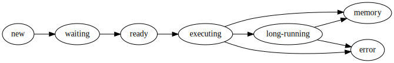
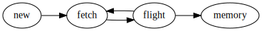

Worker
======

Overview
--------

Workers provide two functions:

1.  Compute tasks as directed by the scheduler
2.  Store and serve computed results to other workers or clients

Each worker contains a ThreadPool that it uses to evaluate tasks as requested
by the scheduler.  It stores the results of these tasks locally and serves them
to other workers or clients on demand.  If the worker is asked to evaluate a
task for which it does not have all of the necessary data then it will reach
out to its peer workers to gather the necessary dependencies.

A typical conversation between a scheduler and two workers Alice and Bob may
look like the following::

   Scheduler -> Alice:  Compute ``x <- add(1, 2)``!
   Alice -> Scheduler:  I've computed x and am holding on to it!

   Scheduler -> Bob:    Compute ``y <- add(x, 10)``!
                        You will need x.  Alice has x.
   Bob -> Alice:        Please send me x.
   Alice -> Bob:        Sure.  x is 3!
   Bob -> Scheduler:    I've computed y and am holding on to it!

Storing Data
------------

Data is stored locally in a dictionary in the ``.data`` attribute that
maps keys to the results of function calls.

.. code-block:: python

   >>> worker.data
   {'x': 3,
    'y': 13,
    ...
    '(df, 0)': pd.DataFrame(...),
    ...
    }

This ``.data`` attribute is a ``MutableMapping`` that is typically a
combination of in-memory and on-disk storage with an LRU policy to move data
between them.

Read more: :doc:`worker-memory`

Thread Pool
-----------

Each worker sends computations to a thread in a
:class:`concurrent.futures.ThreadPoolExecutor`
for computation.  These computations occur in the same process as the Worker
communication server so that they can access and share data efficiently between
each other.  For the purposes of data locality all threads within a worker are
considered the same worker.

If your computations are mostly numeric in nature (for example NumPy and Pandas
computations) and release the GIL entirely then it is advisable to run
``dask-worker`` processes with many threads and one process.  This reduces
communication costs and generally simplifies deployment.

If your computations are mostly Python code and don't release the GIL then it
is advisable to run ``dask-worker`` processes with many processes and one
thread per process::

   $ dask-worker scheduler:8786 --nworkers 8 --nthreads 1

This will launch 8 worker processes each of which has its own
ThreadPoolExecutor of size 1.

If your computations are external to Python and long-running and don't release
the GIL then beware that while the computation is running the worker process
will not be able to communicate to other workers or to the scheduler.  This
situation should be avoided.  If you don't link in your own custom C/Fortran
code then this topic probably doesn't apply.

Command Line tool
-----------------

Use the ``dask-worker`` command line tool to start an individual worker. For
more details on the command line options, please have a look at the
`command line tools documentation
<https://docs.dask.org/en/latest/setup/cli.html#dask-worker>`_.

Internal Scheduling
-------------------

Internally tasks that come to the scheduler proceed through the following pipeline as
:class:`distributed.worker_state_machine.TaskState` objects. Tasks which follow this
path have a :attr:`~distributed.worker_state_machine.TaskState.runspec` defined which
instructs the worker how to execute them.

Data dependencies are also represented as
:class:`~distributed.worker_state_machine.TaskState` objects and follow a simpler path
through the execution pipeline. These tasks do not have a
:attr:`~distributed.worker_state_machine.TaskState.runspec` defined and instead contain
a listing of workers to collect their result from.

As tasks arrive they are prioritized and put into a heap.  They are then taken
from this heap in turn to have any remote dependencies collected.  For each
dependency we select a worker at random that has that data and collect the
dependency from that worker.  To improve bandwidth we opportunistically gather
other dependencies of other tasks that are known to be on that worker, up to a
maximum of 200MB of data (too little data and bandwidth suffers, too much data
and responsiveness suffers).  We use a fixed number of connections (around
10-50) so as to avoid overly-fragmenting our network bandwidth. In the event
that the network comms between two workers are saturated, a dependency task may
cycle between ``fetch`` and ``flight`` until it is successfully collected.

After all dependencies for a task are in memory we transition the task to the
ready state and put the task again into a heap of tasks that are ready to run.

We collect from this heap and put the task into a thread from a local thread
pool to execute.

Optionally, this task may identify itself as a long-running task (see
:doc:`Tasks launching tasks <task-launch>`), at which point it secedes from the
thread pool.

A task either errs or its result is put into memory.  In either case a response
is sent back to the scheduler.

Tasks slated for execution and tasks marked for collection from other workers
must follow their respective transition paths as defined above. The only
exceptions to this are when:

* A task is `stolen <work-stealing>`_, in which case a task which might have
  been collected will instead be executed on the thieving worker
* Scheduler intercession, in which the scheduler reassigns a task that was
  previously assigned to a separate worker to a new worker.  This most commonly
  occurs when a `worker dies <killed>`_ during computation.

.. _nanny:

Nanny
-----

Dask workers are by default launched, monitored, and managed by a small Nanny
process.

.. autoclass:: distributed.nanny.Nanny
   :members:

API Documentation
-----------------

.. autoclass:: distributed.worker_state_machine.TaskState
   :members:

.. autoclass:: distributed.worker.Worker
   :members:
